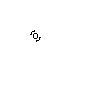

# Game of Life

This is a JavaScript implementation of Conway's famous Game of Life. The project displays the game simply, setting pixel values of a canvas element.

### License

This project is released under the MIT license.
